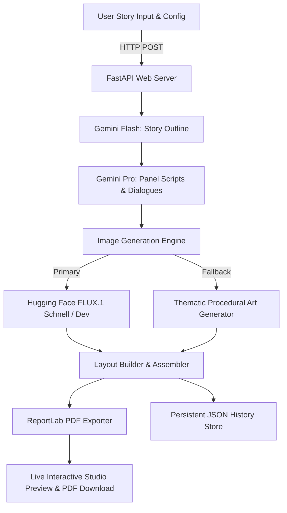

# 🎨 ComicCraft — AI Comic Story & Visual Novel Creator

> **Next-Generation Full-Stack AI Comic Generation Studio**  
> Powered by **Google Gemini Intelligence**, **Hugging Face FLUX.1**, **FastAPI**, and **ReportLab PDF Engine**.

---

## 📖 Project Overview

**ComicCraft** is an end-to-end AI comic creation platform that transforms simple user story prompts and character descriptions into fully realized, illustrated comic books. 

From plot conceptualization and dynamic panel script generation to high-fidelity AI artwork synthesis and multi-page PDF publishing, ComicCraft automates the entire creative pipeline while giving creators complete control over tone, style, character consistency, and narrative pacing.

---

## 🌟 Key Features

### 1. 🧠 Dual-Tier Gemini Narrative Intelligence
- **Gemini Flash (Plot Outlining):** Takes user prompt, character name, setting, tone, and art style to construct a structured story arc dynamically tailored to 2 to 8 panels.
- **Gemini Pro (Scriptwriting & Screenplay):** Crafts rich, panel-by-panel storyboards featuring camera directions (Wide, Close-Up, Action), ambient scene descriptions, narrative captions, and distinct character dialogues.

### 2. 🎨 Multi-Provider AI Art Generation
- **Hugging Face FLUX.1 Integration:** Generates high-definition artwork using state-of-the-art diffusion models (`black-forest-labs/FLUX.1-schnell` / `black-forest-labs/FLUX.1-dev`) via accelerated serverless inference (Nscale / fal-ai).
- **Gemini Native Image Generation:** Alternative native visual generation pipeline.
- **Graceful Thematic Auto-Fallback:** If external API quota limits (e.g., HTTP 402) or network errors occur, the engine instantly renders stylized thematic vector backgrounds (School, Forest, Cave, Space, City, etc.) with comic borders and dialogue speech cards so panel rendering **never fails**.

### 3. 📄 High-Resolution Multi-Page PDF Publishing
- Powered by **ReportLab**, the application compiles the entire comic into a publication-ready PDF book.
- Features formatted title pages, framed artwork panels, high-contrast dialogue callout boxes, panel captions, and scene summaries.

### 4. 🗂️ Persistent Comic History & Instant Re-Download
- Every generated comic is automatically archived with its full storyboard, generated artwork, metadata, timestamp, and downloadable PDF in `static/history.json`.
- Users can browse past creations anytime via the interactive sidebar and re-download PDFs instantly without re-generating.

### 5. 💾 Form Auto-Save (LocalStorage Persistence)
- Never lose your story drafts! All input fields (Concept, Character, Setting, Tone, Art Style, Panel Count) are automatically cached in browser `localStorage` as you type and restored seamlessly across page reloads.

---

## 🛠️ Architecture & Tech Stack



### **Backend & AI Stack**
- **Framework:** FastAPI (Python 3.10+) + Uvicorn ASGI Server
- **Alternative Microservice:** Node.js Express (`server.js`) with `cors`, `dotenv`, and `node-fetch`
- **Large Language Models:** Google Gemini 1.5 Flash / 2.0 Flash / Pro (via `google-genai` & `google-generativeai`)
- **Image Synthesis:** Hugging Face Inference API (`huggingface_hub`), FLUX.1-schnell / FLUX.1-dev
- **PDF Engine:** ReportLab
- **Image Processing:** Pillow (PIL)
- **Data Validation:** Pydantic

### **Frontend Stack**
- **Templates:** Jinja2 server-side rendering
- **Styling:** Custom responsive CSS with Glassmorphism, scenic comic hero aesthetics, animated loading indicators
- **Client Logic:** Vanilla JavaScript with LocalStorage state caching and real-time generation progress feedback

---

## 📁 Project Directory Structure

```
ComicCraft-Final/
├── app/
│   ├── __init__.py
│   ├── main.py              # FastAPI application entry point & router mounting
│   ├── routes.py            # API & UI endpoints (/, /generate, /comic/{id}, /api/history)
│   ├── gemini_flash.py      # Structured story outline generator (Gemini Flash)
│   ├── gemini_pro.py        # Panel-by-panel script & dialogue generator (Gemini Pro)
│   ├── image_generator.py   # Multi-provider image engine (FLUX.1 + Auto-fallback)
│   ├── layout_builder.py    # Assembles panels, scripts, images, and captions
│   ├── exporters.py         # ReportLab multi-page comic book PDF compiler
│   └── history.py           # Persistent JSON comic library manager
├── static/
│   ├── css/                 # Modern studio styles & animations
│   ├── generated/           # Rendered comic panel images & generated PDFs
│   ├── history.json         # Comic history database
│   └── scenic_bg.jpg        # Scenic hero visual asset
├── templates/
│   ├── index.html           # Main creator interface & history drawer
│   ├── comic_preview.html   # Panel-by-panel preview & reading studio
│   └── export_success.html  # Export & download confirmation page
├── .env                     # Environment variables & API keys
├── .env.example             # Example environment configuration
├── package.json             # Node.js Express server dependencies
├── requirements.txt         # Python dependencies
├── server.js                # Express.js server alternative
└── README.md                # Project documentation
```

---

## ⚙️ Installation & Setup

### 1. Prerequisites
- **Python 3.10+** installed
- **Node.js 18+** (Optional, for Express.js server)
- **Google Gemini API Key** ([Get one here](https://aistudio.google.com/))
- **Hugging Face Token** ([Get one here](https://huggingface.co/settings/tokens))

### 2. Clone / Open the Project
```bash
cd ComicCraft-Final
```

### 3. Create & Activate Python Virtual Environment
```bash
# Windows (PowerShell / CMD)
python -m venv .venv
.venv\Scripts\activate

# macOS / Linux
python3 -m venv .venv
source .venv/bin/activate
```

### 4. Install Dependencies
```bash
pip install -r requirements.txt
```

*(Optional Node.js packages if using Express)*
```bash
npm install
```

### 5. Configure Environment Variables
Create a `.env` file in the root directory (or copy from `.env.example`):
```ini
# Google Gemini API Configuration
GEMINI_API_KEY=your_gemini_api_key_here

# Hugging Face Configuration (FLUX.1 Image Engine)
HF_TOKEN=your_huggingface_token_here
HF_IMAGE_MODEL=black-forest-labs/FLUX.1-schnell
HF_PROVIDER=nscale

# Application Port
PORT=8080
```

---

## 🚀 Running the Application

### Option A: Running FastAPI Server (Recommended)
```bash
python -m uvicorn app.main:app --host 127.0.0.1 --port 8080 --reload
```
- 🌐 **Web Studio:** [http://127.0.0.1:8080](http://127.0.0.1:8080)
- 📚 **Interactive Swagger API Docs:** [http://127.0.0.1:8080/docs](http://127.0.0.1:8080/docs)

### Option B: Running Node.js Express Server
```bash
node server.js
```

---

## 🔌 API Endpoints Reference

| Method | Endpoint | Description |
|---|---|---|
| `GET` | `/` | Renders the ComicCraft Studio creation page |
| `POST` | `/generate` | Submits form, generates story, artwork, and redirects to preview |
| `POST` | `/generate-comic/json` | REST API endpoint to generate comic returning JSON response |
| `GET` | `/comic/{comic_id}` | Loads a previously saved comic from history |
| `GET` | `/api/history` | Returns the list of all archived comics and PDF URLs |
| `GET` | `/export-success` | Success page with direct PDF download button |
| `GET` | `/api/health` | Service health status check |

---

## 💡 How It Works (Step-by-Step)

1. **Enter Your Story Idea:** Provide a core concept (e.g. *"A student discovers a time machine in the college physics lab"*), character name, setting, tone, and visual style.
2. **Select Panels:** Choose story length from **2 to 8 panels**.
3. **AI Script & Dialogue Generation:** Gemini decomposes the plot into distinct narrative beats and realistic character dialogues with scene direction.
4. **Artwork Generation:** FLUX.1 paints each scene based on contextual visual prompts.
5. **Live Preview & Studio:** Read the comic panel-by-panel with dialogues and captions.
6. **Download & Share:** Export your comic as a styled, multi-page PDF book with one click.

---

## 🛡️ License & Acknowledgements
- Developed for AI storytellers, educators, students, and creative writers.
- Powered by **Google DeepMind Gemini** and **Hugging Face FLUX**.
